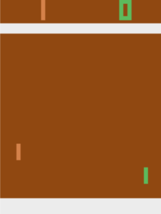

# *Pong!* from pixels
  

In [this notebook](https://github.com/andrefmsmith/amsRL_openAIgym/blob/master/Pong/CodeBlog_PongFromPixels_2.0.ipynb) we will train a deep neural network to learn *Pong!* from pixels using policy gradients, mini-batch training and Future Rewards. A [checkpoint](https://github.com/andrefmsmith/amsRL_openAIgym/blob/master/Pong/pongReinforce_21032020.policy) for a winning agent is included as well.
